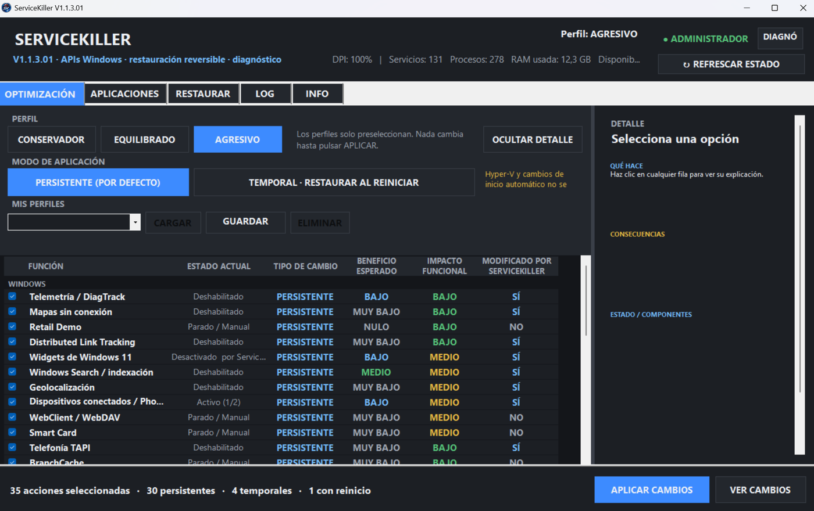

<p align="center">
  
</p>

# ServiceKiller
[](https://github.com/Gnoma2/ServiceKiller/releases/latest)
[](https://github.com/Gnoma2/ServiceKiller/actions/workflows/build.yml)
[](LICENSE)
[](#)

<p align="center">
  <a href="https://github.com/Gnoma2/ServiceKiller/releases/download/v1.1.3.01/ServiceKiller-v1.1.3.01-win-x64.zip">
    <strong>⬇ Download latest release</strong>
  </a>
</p>

**ServiceKiller** is an open-source Windows utility designed to reduce selected background activity through **reversible** changes to services, processes, startup entries and specific system settings.

> **Currently validated platform:** Windows 11 Pro 25H2 x64, build 26200.  
> **Windows 10:** not validated for this public version. Compatibility is not claimed.

Current public version: **V1.1.3.01**. License: **GPL-3.0-only**.

[README en español](README.md)
<p align="center">
  
</p>

## Quick installation

1. Download `ServiceKiller-v1.1.3.01-win-x64.zip` from [Releases](https://github.com/Gnoma2/ServiceKiller/releases/latest).
2. Extract **all contents of the ZIP** into a folder.
3. Keep `ServiceKiller.exe` and `ServiceKiller.exe.config` together in the same folder.
4. Run `ServiceKiller.exe` **as administrator**.

> ServiceKiller does not use an installer. Before applying changes, review the selected profile and actions.

## Verify the download

The Release includes `SHA256SUMS.txt` so you can verify the integrity of the published files.

In PowerShell, from the folder where you downloaded the ZIP:

```powershell
Get-FileHash .\ServiceKiller-v1.1.3.01-win-x64.zip -Algorithm SHA256
```

The result must match the SHA-256 value listed in `SHA256SUMS.txt`.

## Main features

ServiceKiller provides **Conservative**, **Balanced** and **Aggressive** profiles, a preview before applying changes, persistent restoration journals, and a temporary-until-reboot mode.

The temporary mode uses Task Scheduler 2.0 COM and a protected restore worker stored under `C:\ProgramData\ServiceKiller\SessionRestore`. The worker is protected and SHA-256 verified before use.

ServiceKiller does **not** offer tweaks that disable Defender, SmartScreen, Firewall, Windows Update/BITS, audio, microphone/camera, or core networking services marked as protected by the catalog.

The public source tree does not implement telemetry or network data transmission.

## Build

Requirements: Windows and .NET Framework 4.8.

Run:

```bat
BUILD_RELEASE.bat
```

The executable is written to `artifacts\ServiceKiller.exe`. The script prints its SHA-256 and does not run it automatically.

The Visual Studio solution is at `src\ServiceKiller\ServiceKillerV1.sln`.

## Documentation

- [Full tweak catalog](docs/TWEAKS.md)
- [Architecture and restoration model](docs/ARCHITECTURE.md)
- [Compatibility](docs/COMPATIBILITY.md)
- [Validation](docs/VALIDATION.md)
- [Privacy](PRIVACY.md)
- [Security policy](SECURITY.md)

## Performance claims

ServiceKiller does not claim universal FPS, latency or performance improvements. Any “expected benefit” shown by the UI is a qualitative estimate of potential background-activity reduction, not a performance guarantee.

## License

Copyright © 2026 **@SirAlexelgrande**.

Released under **GNU GPL v3 only (`GPL-3.0-only`)**. See [LICENSE](LICENSE).

## Independence

ServiceKiller is an independent project and is not affiliated with, sponsored by, or endorsed by Microsoft or by vendors of applications that it can detect or close. Product names and trademarks belong to their respective owners.
